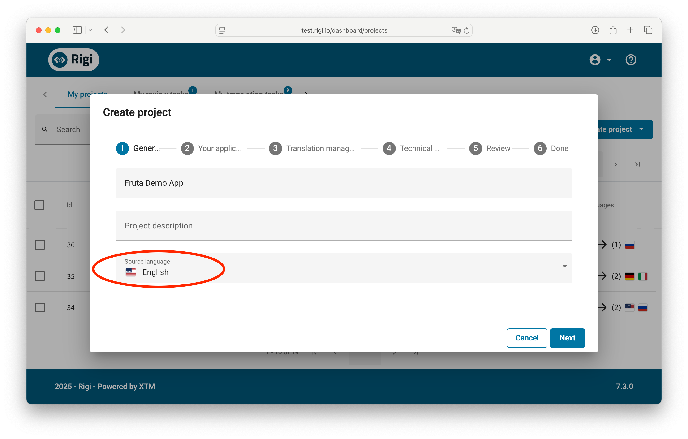
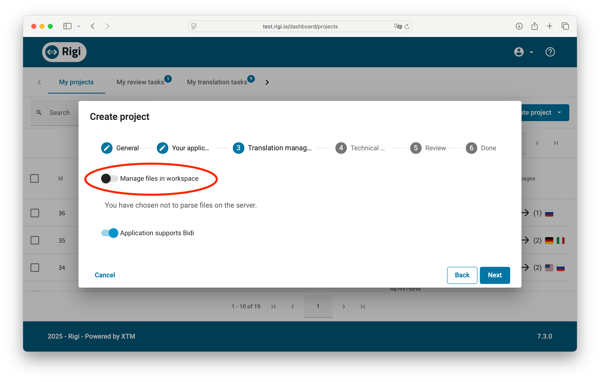

# Rigi iOS Capture

**Rigi iOS Capture** is a powerful macOS application that streamlines the localization preview workflow for iOS developers. It enables direct capture from iOS Simulators and seamless integration with the Rigi localization platform.

## Table of Contents

1. [Introduction](#introduction)
2. [Key Features](#key-features)
3. [System Requirements](#system-requirements)
4. [Installation](#installation)
5. [Getting Started](#getting-started)
6. [Workflow Overview](#workflow-overview)
7. [Step-by-Step Guide](#step-by-step-guide)
   - [1. Create or Select a Project](#1-create-or-select-a-project)
   - [2. Configure Project Settings](#2-configure-project-settings)
   - [3. Setup Your Xcode Project](#3-setup-your-xcode-project)
   - [4. Sync Localization Files](#4-sync-localization-files)
   - [5. Import Pseudo Language](#5-import-pseudo-language)
   - [6. Capture Previews](#6-capture-previews)
   - [7. Translate with Preview Context](#7-translate-with-preview-context)
8. [Tips and Best Practices](#tips-and-best-practices)
9. [Troubleshooting](#troubleshooting)
10. [Support](#support)

 

## Introduction

**Rigi iOS Capture** replaces the traditional SDK and command-line workflow with a modern, user-friendly macOS application. It provides a complete solution for capturing localization previews from iOS Simulators and managing the entire localization workflow with the Rigi platform.

Find out more about the Rigi Software Localization Tool at [https://xtm.cloud/rigi/](https://xtm.cloud/rigi/)

 

## Key Features

- **Native macOS Application** - No SDK integration required in your Xcode project
- **Direct Simulator Capture** - Capture screenshots directly from running iOS Simulators
- **Automatic OCR Scanning** - Intelligent text detection and recognition
- **Project Management** - Organize multiple localization projects
- **Seamless Rigi Integration** - Direct upload to Rigi server
- **Visual Preview Generation** - Automatic preview creation with text highlighting
- **Localization Sync** - Import/export XLIFF files with pseudo language support

 

## System Requirements

- macOS 11.0 (Big Sur) or later
- Xcode 13.0 or later
- Active iOS Simulator
- Rigi server account with API access

 

## Installation

1. Download the latest installer from [https://github.com/xtrf/rigi-ios-capture](https://github.com/xtrf/rigi-ios-capture)
2. Open the downloaded DMG file
3. Drag **Rigi iOS Capture.app** to your Applications folder
4. If you need to uninstall later, use the included uninstaller

 

## Getting Started

### First Launch

1. Open **Rigi iOS Capture** from your Applications folder
2. The app will prompt you to create your first project
3. Follow the setup wizard to configure your project

### Connect to Rigi Server

Before starting, ensure you have:
- Your Rigi server URL (e.g., `https://test.rigi.io`)
- An API access token with appropriate permissions

 

## Workflow Overview

The Rigi iOS Capture workflow consists of these main steps:

1. **Setup** - Configure project and connect to Rigi server
2. **Export** - Export localization catalog from Xcode
3. **Sync** - Upload localizations to Rigi and receive pseudo language
4. **Import** - Import pseudo language back to Xcode
5. **Capture** - Run app in Simulator and capture screens
6. **Upload** - Send previews to Rigi for translation
7. **Translate** - Translators work with visual context on Rigi platform

 

## Step-by-Step Guide

### 1. Create or Select a Project

When you first launch Rigi iOS Capture, you'll need to create a project:

1. Click the project dropdown and select "Create project"
2. Enter a project name (e.g., "Fruta Demo")
3. Click **Create Project**

### Creating a Rigi Project (First Time Setup)

If this is your first time setting up on the Rigi server:

1. Log into your Rigi server
2. Create a new project
3. Select your source language (e.g., English)
4. Configure the project settings

5. Set the pseudo language to match your Xcode configuration (e.g., Zulu)
6. Save the project configuration

7. Add the target languages for translation
8. These are the languages your app will be translated into

### 2. Configure Project Settings

Configure your project in three steps:

#### Project Folder
1. Click **Select Project Folder**
2. Navigate to your Xcode project's root directory
3. The app will automatically detect:
   - Xcode project details
   - Localization status
   - Available languages

#### Rigi Configuration
1. Enter your **Project Server URL** from the Rigi platform
2. Select **Source Language** (e.g., English)
3. Select **Pseudo Language** (e.g., Zulu)
4. Click **Save Configuration**

#### Server Authentication
1. Generate an API token on the Rigi server:
   - Navigate to your project on Rigi
   - Go to Settings → Access tokens
   - Create a new token with required permissions:
     - Update project settings
     - Upload to workspace
     - Download from workspace
     - Tokenize strings
     - Upload HTML Previews
   
   

2. Copy the token and paste it in the app
3. Click **Test Connection** to verify
4. Click **Save Token** to store securely

### 3. Setup Your Xcode Project

Before capturing previews, prepare your Xcode project:

#### Create a Dedicated Target (Optional)

For better organization, you can create a dedicated target for Rigi captures:

1. Duplicate your existing target in Xcode
2. Name it appropriately (e.g., "Fruta iOS Capture")
3. This keeps your production builds separate from capture builds

#### Add Pseudo Language

1. In Xcode, go to your project settings
2. Add a new localization language (we recommend Zulu - zu)
3. This will be your pseudo language for preview generation

#### Export Localization Catalog

1. In Xcode, select **Product → Export Localizations...**
2. Save the localization catalog to a convenient location

### 4. Sync Localization Files

Upload your localization files to Rigi:

1. Switch to the **Sync Localization** tab
2. Drag and drop your exported localization folder or click **Browse Files**
3. The app will validate and count translatable strings
4. Click **Upload to Rigi**
5. After successful upload, click **Open Import Folder**

The upload process will:
- Send all localization files to Rigi server
- Generate pseudo language file with special markers `[# text #]`
- Download the prepared pseudo language file

### 5. Import Pseudo Language

Import the generated pseudo language back to Xcode:

1. In Xcode, select **Product → Import Localizations...**
2. Navigate to the import folder opened in the previous step
3. Select the pseudo language XLIFF file (e.g., `zu.xliff`)
4. Import it to your project

### 6. Capture Previews

Now you're ready to capture previews:

#### Run Your App
1. In Xcode, create a new scheme or duplicate existing one
2. Set the **App Language** to your pseudo language (e.g., Zulu)
3. Run the app in iOS Simulator

#### Capture Screenshots
1. In Rigi iOS Capture, switch to the **Capture Previews** tab
2. Select your running simulator from the dropdown
3. Navigate to a screen in your app
4. Click **Capture**

The capture process will:
- Take a screenshot of the current simulator screen
- Use OCR to detect all text elements
- Match detected text with your localization strings
- Highlight recognized strings in green
- Show statistics (scanned vs. translatable)

#### Review and Upload
1. Review the preview with highlighted text areas
2. Check the statistics to ensure strings were recognized
3. Click **Upload to Server** to send to Rigi

### 7. Translate with Preview Context

Once previews are uploaded, translators can work with visual context:

1. Create a translation task on the Rigi server
2. Translators can see the preview alongside each string
3. Changes are reflected in real-time on the preview
4. Complete translations and export when ready

 

## Tips and Best Practices

### Project Organization
- Create separate projects for each app or major feature
- Use descriptive project names
- Keep your API tokens secure

### Pseudo Language Selection
- Choose a language not used in your target markets
- Zulu (zu) is recommended as it's rarely used in apps
- Ensure the pseudo markers `[# #]` are visible in your app

### Capture Quality
- Ensure text is clearly visible in the simulator
- Capture at standard zoom levels (100%)
- Navigate through all app screens systematically
- Check coverage statistics to track progress

### Server Configuration
- Always test your connection before starting work
- Keep your API token in the macOS Keychain for security
- Create project-specific tokens with minimal required permissions

 

## Troubleshooting

### Common Issues

**Simulator not detected**
- Ensure iOS Simulator is running
- Try refreshing the simulator list
- Restart the Simulator if needed

**Low string recognition**
- Verify pseudo language is properly imported
- Check that strings are wrapped in `[# #]` markers
- Ensure OCR can read the text clearly

**Connection failures**
- Verify your Rigi server URL
- Check API token permissions
- Ensure network connectivity

**Import folder not opening**
- Check file permissions
- Verify the export was successful
- Look for the folder on your Desktop

### Debug Information

The app provides detailed feedback:
- Connection status in the footer
- Upload progress indicators
- String count statistics
- OCR scanning results

 

## Support

For additional help and resources:

- **Documentation**: [https://xtm.cloud/rigi/](https://xtm.cloud/rigi/)
- **GitHub Issues**: [https://github.com/xtrf/rigi-ios-capture](https://github.com/xtrf/rigi-ios-capture)
- **Rigi Support**: Contact your Rigi administrator

---

Copyright © 2025 Rigi.io powered by XTM. All rights reserved.

Use of Rigi iOS Capture is allowed in combination with a paid Rigi Cloud subscription.
Terms and conditions apply, see [https://rigi.io/terms-and-conditions-2025/]()